<div align="center">

# Hey, I'm Omer! 

**AI Engineer | MS in AI @ SUNY Buffalo | Researcher | Builder**

[](https://linkedin.com/in/syed-omer-shah)
[](mailto:syedomer@buffalo.edu)
[](https://huggingface.co/OmerShah)
[](https://github.com/Syedomershah99)

</div>

---

```python
class Omer:
    def __init__(self):
        self.role       = "AI Engineer & Researcher"
        self.school     = "MS in Artificial Intelligence @ SUNY Buffalo"
        self.interests  = ["Agentic AI", "LLMs", "Multi-Modal Learning", "Bayesian Optimization"]
        self.fun_fact   = "I've won 3 hackathons back-to-back and still can't fix my sleep schedule"
    
    def currently_building(self):
        return [
            "Bayesian Optimization for SPECT hardware design on HPC",
            "Bayesian Optimization for polymer discovery",
            "Agentic pipelines with LangGraph & CrewAI",
        ]
    
    def ask_me_about(self):
        return ["PyTorch", "RAG pipelines", "LLM quantization", "HPC with Slurm", "AWS"]
```

---

### What I Do

<table>
<tr>
<td width="50%">

**Research**
- Multi-modal Transformers (GNN + 3D fusion)
- Bayesian Optimization for materials discovery
- Bayesian Optimization for medical imaging on HPC
- 4 publications (arXiv, Springer, SNMMI)

</td>
<td width="50%">

**Engineering**
- Agentic AI pipelines (LangGraph, CrewAI)
- Production RAG with vector databases
- LLM optimization (LoRA, quantization, vLLM)
- End-to-end ML infra & deployment

</td>
</tr>
</table>

---

### Featured Projects

| Project | What it does | Stack |
|:--------|:------------|:------|
| [**MolFM-Lite**](https://github.com/Syedomershah99/molfm-lite) | Multi-modal molecular property prediction. 0.956 AUC, first-author [arXiv paper](https://arxiv.org/abs/2602.22405) | PyTorch, GNNs, Transformers, Cross-Attention |
| [**Multimodal AAC Chatbot**](https://github.com/Syedomershah99/Multimodal-AAC-Chatbot) | Agentic chatbot for accessible communication. 1.10s latency, 100% routing accuracy | LangGraph, Gemini, RAG, Wearable Signals |
| [**FabViz**](https://github.com/Syedomershah99/FabViz) | Semiconductor yield analysis dashboard. [Live demo](https://fabviz.streamlit.app) | Streamlit, XGBoost, SPC Charts |
| [**SafeDispatch**](https://github.com/Syedomershah99/safe-dispatch) | RL for safety-constrained power grid dispatch. 3% cost gap, zero violations | TD3, PyTorch, DC-OPF |
| [**CVE-Semantic**](https://github.com/Syedomershah99/CVE-semantic-IEEE) | Learning vulnerability patterns from CVE fix diffs | NLP, Semantic Analysis |
| [**DeepSeek-R1 on Bedrock**](https://github.com/Syedomershah99/DeepSeek-R1-on-Bedrock) | Deployed reasoning LLM on AWS Bedrock | AWS Bedrock, Python |

---

### Tech Stack

<div align="center">

**Languages & Core**


**ML & Deep Learning**


**LLMs & Agentic AI**


**Cloud & Infra**

-FF9900?style=flat-square&logo=amazonaws&logoColor=white)


</div>

---

### Publications

| # | Title | Venue |
|:-:|:------|:------|
| 1 | **MolFM-Lite**: Multi-Modal Molecular Property Prediction | [arXiv:2602.22405](https://arxiv.org/abs/2602.22405) (2026) |
| 2 | **VMatter**: AI-Enabled IoT Patient Monitoring | Oral @ ICMLDSSIA-2025, Springer Nature |
| 3 | Quantitative Framework for Optimizing SPECT Design | Oral @ SNMMI 2026 |
| 4 | Multiplexing-Induced Ghost Artifact in SPECT | Poster @ SNMMI 2026 |

---

### Hackathon Wins

<div align="center">

| Hackathon | Rank | Teams |
|:----------|:----:|:-----:|
| Next InTech Ideathon (GradRight + Lehigh) | **1st** | 300 |
| HackZ (Osmania TBI + Edwisely) | **1st** | 350 |
| Hack-the-Verse (CMR National) | **1st** | 550+ |

</div>

---

### GitHub Stats

<div align="center">



<picture>
  <source media="(prefers-color-scheme: dark)" srcset="https://raw.githubusercontent.com/Syedomershah99/Syedomershah99/output/github-snake-dark.svg" />
  <source media="(prefers-color-scheme: light)" srcset="https://raw.githubusercontent.com/Syedomershah99/Syedomershah99/output/github-snake.svg" />
  
</picture>

</div>


---

<div align="center">

**If you made it this far, let's connect!**

I'm always down to chat about AI, research, hackathons, or basketball.

[](https://linkedin.com/in/syed-omer-shah)

</div>
